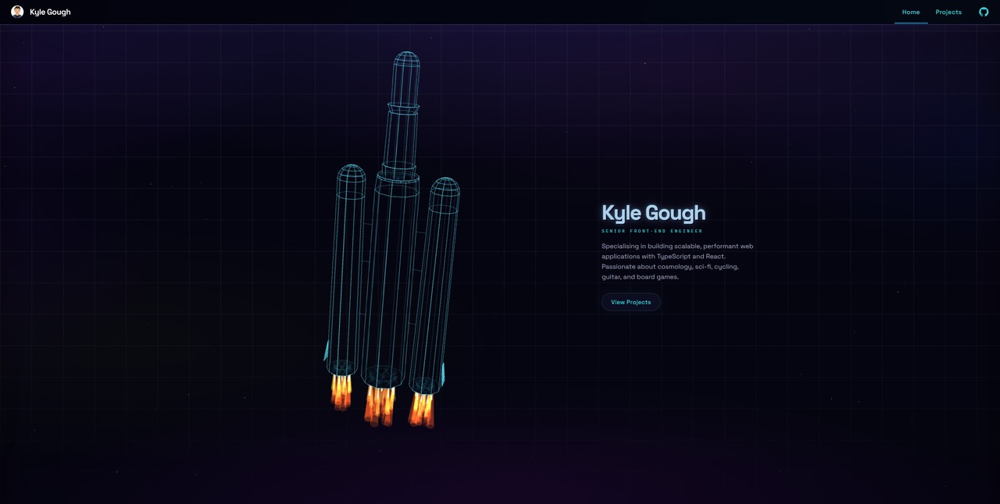
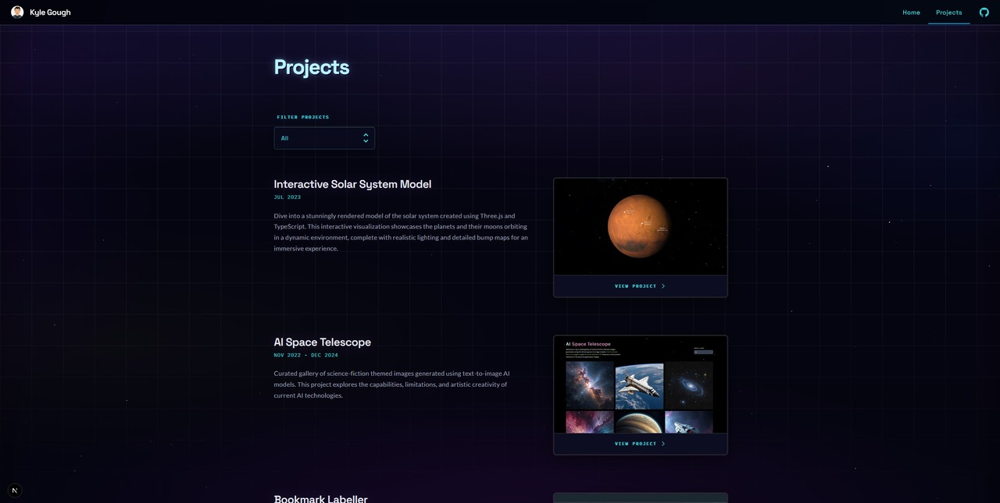

<h1><a href="https://kylegough.co.uk" target="_blank" rel="noreferrer">kylegough.co.uk</a></h1>

<br />

<div>
  <a href="https://github.com/KyleGough/portfolio/actions?query=branch%3Amaster"></a>
  <a href="https://github.com/KyleGough/portfolio/commits/master"></a>
  <a href="https://github.com/KyleGough/portfolio/pulls"></a>
  <a href="https://github.com/KyleGough/portfolio/pulls?q=is%3Apr+is%3Aclosed"></a>
  <a href="https://kylegough.co.uk"></a>
</div>

<br />

<p>Personal portfolio website created to showcase my projects and technical skills. Initially created as a static HTML website, the website has experienced multiple upgrades over the years including migration to PHP, Create React App, and most recently Next.js.</p>

<p>The homepage hero includes a timeline-driven <a href="https://threejs.org/">Three.js</a> Falcon Heavy rocket wireframe (staging, booster separation, plumes, and lighting) rendered alongside the rest of the site.</p>

## Tech Stack

[TypeScript](https://www.typescriptlang.org/), [Next.js](https://nextjs.org/) 16 / [React](https://react.dev/) 19 · [Three.js](https://threejs.org/) · [Tailwind CSS](https://tailwindcss.com/).  
[ESLint](https://eslint.org/) 9 · [Prettier](https://prettier.io/) · [EditorConfig](https://editorconfig.org/) · [Jest](https://jestjs.io/) & [Testing Library](https://testing-library.com/).  
[Vercel](https://vercel.com/) · [GitHub Actions](https://github.com/features/actions).

## Prerequisites

- **Node.js** 24 or newer (`engines` in `package.json`)

## Scripts

### Dev Server

The project uses [Next.js](https://nextjs.org/). The development server supports hot reloading and runs at `http://localhost:3000` by default.

```sh
npm run dev
```

### Linting

```sh
npm run lint
```

### Build

Production build: optimised output and per-route information from Next.js.

```sh
npm run build
```

### Unit Tests

The portfolio uses [Jest](https://jestjs.io/) as the test runner for unit tests. Each component has a corresponding unit tests saved in the format `*.test.tsx` or `*.test.ts`. To run all unit tests, run the following command:

```sh
npm run test:ci
```

## Screenshots




