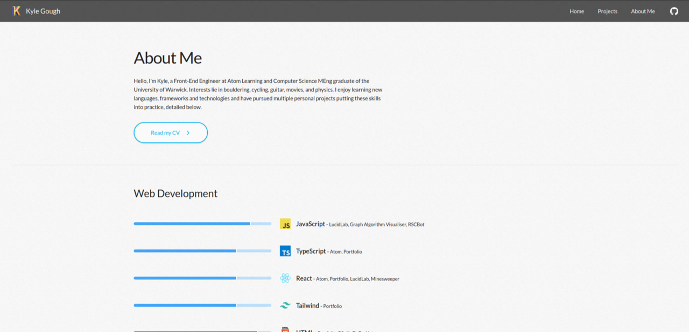

<h1>Portfolio</h1>

<div>
  <a href="https://kylegough.co.uk" target="_blank" rel="noreferrer"></a>
</div>

<br />

<div>
  <a href="https://github.com/KyleGough/portfolio/actions?query=branch%3Amaster">
    
  </a>
  <a href="https://github.com/KyleGough/portfolio/actions/workflows/cypress.yml">
    
  </a>
  <a href="https://github.com/KyleGough/portfolio/commits/master">
    
  </a>
  <a href="https://github.com/KyleGough/portfolio/pulls">
    
  </a>
  <a href="https://github.com/KyleGough/portfolio/pulls?q=is%3Apr+is%3Aclosed">
    
  </a>
  <a href="https://kylegough.co.uk">
    
  </a>
</div>

<br />

<p>Personal portfolio website created to showcase my projects and technical skills. Initially created as a static HTML website, the website has experienced multiple upgrades over the years including migration to PHP, Create React App, and most recently Next.js.</p>

## Tech Stack

- **Language**: [TypeScript](https://www.typescriptlang.org/)
- **Frameworks**: [Next.js](https://nextjs.org/), [React](https://reactjs.org/)
- **CSS Framework**: [TailwindCSS](https://tailwindcss.com/)
- **Formatting**: [Prettier](https://prettier.io/), [EditorConfig](https://editorconfig.org/)
- **Linting**: [ESLint](https://eslint.org/)
- **Testing**: [Testing Library](https://testing-library.com/), [Jest](https://jestjs.io/), [Cypress](https://www.cypress.io/)
- **Deployment**: [Vercel](https://vercel.com/)
- **CI/CD**: [GitHub Actions](https://github.com/features/actions)
- **Analytics**: [SplitBee](https://splitbee.io/), [Cloudflare](https://www.cloudflare.com/)
- **Other**: [Cloudflare](https://www.cloudflare.com/)

## Scripts

### Dev Server

The project is built upon the [Next.js](https://nextjs.org/) framework. The development server can be run with the following command allowing hot-code reloading, error reporting, and more. By default the website will run at `http://localhost:3000`.

```sh
npm run dev
```

### Linting

Linting of the project is achieved using [ESLint](https://eslint.org/).

```sh
npm run lint
```

### Build

To create the production-ready build of the website run the following command. The build files will be optimised, compressed. Furthermore the file size of each route and how each route will be rendered is logged.

```sh
npm run build
```

### Unit Tests

The portfolio uses [Jest](https://jestjs.io/) as the test runner for unit tests. Each component has a corresponding unit tests including snapshots saved in the format `*.test.tsx` or `*.test.ts`. To run all unit tests, run the following command:

```sh
npm run test:ci
```

To run all unit tests whilst updating unit test snapshots:

```sh
npm run test:ci -- -u
```

### e2e Tests

[Cypress](https://www.cypress.io/) is used to run end-to-end tests of the website in a browser. Such tests include the navigation, footer, and contact form. For Cypress to work, the dev server must be running on port `3000` with `npm run dev`. To run Cypress in a browser run the following command:

```sh
npm run e2e
```

To run Cypress on the command line run:

```sh
npm run e2e:headless
```

## Screenshots



